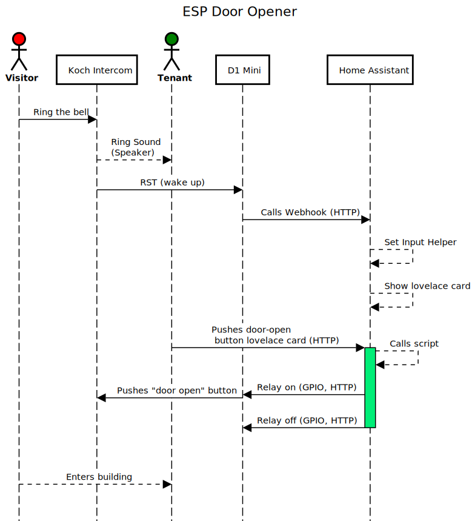

# Smart Door-Opener for Koch Intercom
Project to integrate a legacy (1970s) Koch 933UP Multi-Apartment Intercom into Home Assistant and be able to open the door when someone rings the bell.

The system is designed to influence the existing system as little as possible (by using an optocoupler) as failures could impact other tenants in the building as well. This is why a dedicated 5V power-supply is used.

## Sequence Diagram

## Parts
* 5V USB Power-Supply (e.g. Powerbank). NOTE: the powerbank *must not* cut power if low currents are present (during ESP deep sleep). I used this [battery shield](https://www.aliexpress.com/item/4001118637158.html?spm=a2g0s.9042311.0.0.2fd14c4dPqfgSa) and a 2000mAh 18650 battery.
* 1x Wemos D1 Mini (ESP8266) or similar (1 GPIO + WLAN needed)
* 1x D1 Mini [Single Relay Shield](https://www.aliexpress.com/item/4000420770002.html?spm=a2g0s.9042311.0.0.2fd14c4dPqfgSa)
* 1x D1 Mini [ProtoBoard Shield](https://www.aliexpress.com/item/32766059774.html?spm=a2g0s.9042311.0.0.2fd14c4dPqfgSa)
* 1x Resistor (see below for sizing)
* 1x Diode 1N4148
* 1x Optocoupler PC817
* 4-wire connector cable (e.g. RGB LED-strip cable)

## Schematic

### Intercom Connections
As shown in the schematic above, the following connections were soldered directly onto the intercom's PCB:
* Speaker output
* "Door open" button

### Resistor Sizing ###
The sizing of the resistor depends on the voltage on the speaker. In our Koch K933UP we measured around 1.0V with a multimeter. As the speaker get's AC current, this means we have a peak of 1.41V.

The PC817 optocoupler has a forward voltage of 1.2V and a current of 20mA. This means we need to have a voltage drop of around 0.2V.

Base formula: U=R*I
U=Voltage V
R=Resistor Ohm
I=Current A

Our example:

R = U/I = 0.2V / 0.02A = 10 Ohm

### Hardware Pictures
* [D1 Mini Board](pictures/d1-mini-board.jpeg)
* [Koch 933UP Connection](pictures/koch-k933up-d1-opener.jpeg)

## Software
This project is based on a configuration for [Home Assistant](https://www.home-assistant.io/) however is not limited to it. Any other home-automation software can be used as long as HTTP communication is possible from/to it.

### Wemos D1 Mini - ESPHome Configuration
The microcontroller has been configured with ESPhome. The corresponding configuration file can be found below:

[ESPHome Config File](esphome/d1-mini-door-opener-esp.yaml)

The microcontroller connects to the WiFi during the boot process. It goes into deep-sleep mode again after 90s to save power.

### Home Assistant
The following things need to be configured within Home Assistant
* Boolean Input helper ([configuration.yaml](home-assistant/configuration.yaml)): indicates wheter or not the ESP is in deep-sleep mode
* Webhook Automation ([automations.yaml](home-assistant/automations.yaml)): sets state of input helper when webhook is called
* Shell commands ([configuration.yaml](home-assistant/configuration.yaml)): to send HTTP calls to the ESP to change relay state
* Script ([scripts.yaml](home-assistant/scripts.yaml)): to execute shell commands and other stuff

NOTE: The ESPHome integration/API of Home Assistant wasn't used, as it takes too long to recognize when the device comes online. With the webhook setup Home Assistant is aware immediately that the device is up as soon as it booted.

