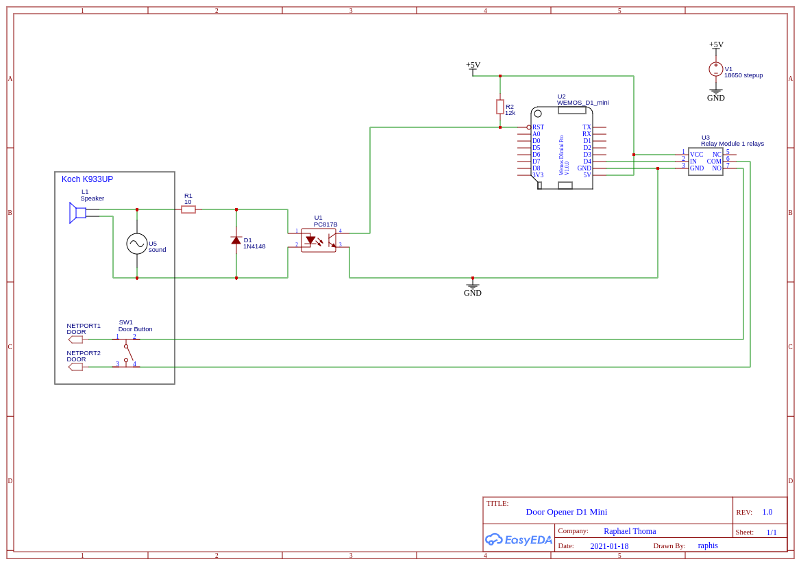

# koch-esp-door-opener
Project to integrate a legacy (1970s) Koch 933UP Multi-Apartment Intercom into Home Assistant and be able to open the door when someone rings the bell.

The system is designed to influence the existing system as little as possible (by using an optocoupler) as failures could impact other tenants in the building as well.
FIXME: mention why a dedicated power-supply is being used

## Parts
* 5V USB Power-Supply (e.g. Powerbank). NOTE: the powerbank must not cut power if low currents are present (during ESP deep sleep). I used this [battery shield](https://www.aliexpress.com/item/4001118637158.html?spm=a2g0s.9042311.0.0.2fd14c4dPqfgSa) and a 2000mAh 18650 battery.
* 1x Wemos D1 Mini or similar (1 GPIO + WLAN needed)
* 1x D1 Mini [Single Relay Shield](https://www.aliexpress.com/item/4000420770002.html?spm=a2g0s.9042311.0.0.2fd14c4dPqfgSa)
* 1x D1 Mini [ProtoBoard Shield](https://www.aliexpress.com/item/32766059774.html?spm=a2g0s.9042311.0.0.2fd14c4dPqfgSa)
* Resistors
** 1x 10 Ohm
** 1x 12k Ohm
* 1x Diode 1N4148
* 1x Optocoupler PC817
* 1x Logic OR-Gate (e.g. 74HC32)

## Schematic

## Software
This project is based on a configuration for [Home Assistant](https://www.home-assistant.io/) however is not limited to it. Any other home-automation software can be used as long as HTTP communication is possible from/to it.

### Wemos D1 Mini - ESPHome Configuration
The microcontroller has been configured with ESPhome. The corresponding configuration file can be found below:

[ESPHome Config File](esphome/d1-mini-door-opener-esp.yaml)

### Home Assistant
The following things need to be configured within Home Assistant
* Boolean Input helper: indicates wheter or not the ESP is in deep-sleep mode
* Webhook Automation: sets state of input helper when webhook is called
* Shell commands: to send HTTP calls to the ESP to change relay state
* Script: to execute shell commands and other stuff

FIXME: mention why ESPhome integration wasn't used 

## HowTo

